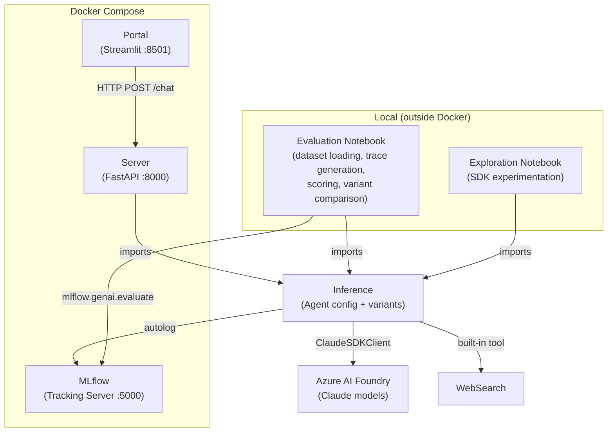
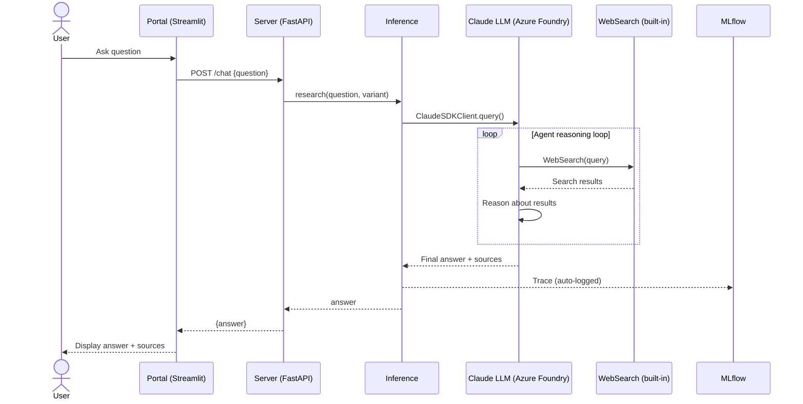
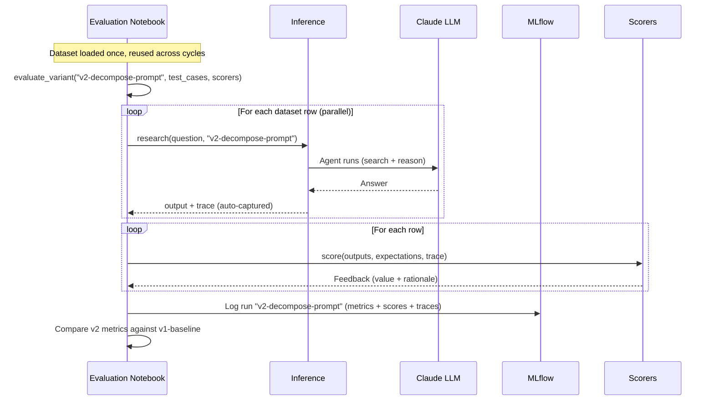
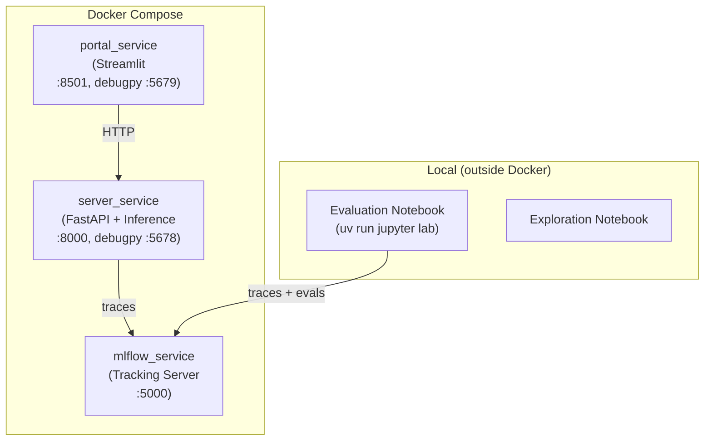
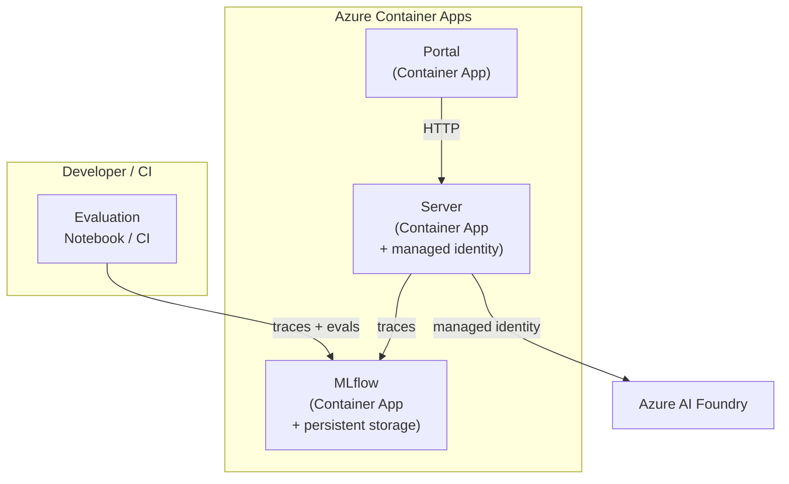

# Architecture

How ScholarBot is structured, how the components interact, and the key design decisions that shaped them.

---

## System Overview



The inference module is a shared Python library, not a service. It's imported by the server (inside Docker) and by notebooks (outside Docker). This ensures the same agent logic is served and evaluated.

---

## Module Structure

```
src/
├── inference/        # Agent configuration, variants, and execution (shared)
├── evaluation/       # Dataset loaders, scorers, predict_fn helpers
├── server/           # FastAPI HTTP interface (imports inference)
└── portal/           # Streamlit UI (calls server over HTTP)

notebooks/
├── evaluation.ipynb  # Primary eval workspace (Phases B-D of eval process)
└── agent-sdk-exploration.ipynb  # SDK experimentation
```

### Inference (`src/inference/`)

The core agent logic — what the agent is and how it runs. Both the server and evaluation notebooks import from here.

Defines **agent variants**: named configurations (prompt, model, topology) representing each improvement attempt (e.g., `v1-baseline`, `v2-decompose-prompt`, `v3-sonnet-upgrade`). Exposes `get_agent_options(variant)` and `research(question, variant)`.

### Evaluation (`src/evaluation/`)

Reusable building blocks for the evaluation workflow: dataset loaders, variant-aware `predict_fn` factory, custom scorers. The evaluation notebook is the primary runner; this module provides the components.

### Server (`src/server/`)

Thin HTTP wrapper around inference. Exposes the currently deployed variant via `POST /chat`. Also serves `GET /health`.

### Portal (`src/portal/`)

Streamlit UI. Calls the server over HTTP. No dependency on inference or evaluation.

---

## Key Interfaces

### 1. Server → Inference

The server imports `research()` from inference, using the deployed variant.

```python
# src/server/main.py
from inference import research

DEPLOYED_VARIANT = "v1-baseline"

@app.post("/chat")
async def chat(request: ChatRequest) -> ChatResponse:
    answer = await research(request.question, variant=DEPLOYED_VARIANT)
    return ChatResponse(answer=answer)
```

### 2. Evaluation Notebook → Inference

The notebook creates variant-aware predict functions for MLflow evaluation.

```python
# In the evaluation notebook
import asyncio
from inference import research

def make_predict_fn(variant: str):
    def predict_fn(question: str) -> str:
        return asyncio.run(research(question, variant=variant))
    return predict_fn

def evaluate_variant(variant: str, test_cases, scorers=None):
    predict_fn = make_predict_fn(variant)
    with mlflow.start_run(run_name=variant, tags={"variant": variant}):
        return mlflow.genai.evaluate(
            data=test_cases,
            predict_fn=predict_fn,
            scorers=scorers or [],
        )
```

### 3. Portal → Server

The portal calls the server over HTTP. It has no awareness of inference, evaluation, or variants.

```python
# src/portal/main.py
response = httpx.post(f"{SERVER_URL}/chat", json={"question": question})
```

---

## Data Flow

### Research Query (User → Answer)



### Evaluation Cycle (Variant → Scores → Compare)



---

## Technology Decisions

| Component | Choice | Rationale |
|-----------|--------|-----------|
| Agent framework | Claude Agent SDK | Meta directive; Phase A of framework comparison |
| LLM | Claude Haiku 4.5 via Azure AI Foundry | Cost-effective for baseline; model tier is an optimization lever |
| Web search | Agent SDK built-in WebSearch | Eliminates external search dependency |
| HTTP framework | FastAPI | Async support, Pydantic models, standard |
| UI | Streamlit | Near-term simplicity; React/Next.js planned for Milestone 5 |
| Observability | MLflow 3.x | Tracing, evaluation, experiment tracking in one platform |
| Eval runner | Jupyter notebook | Interactive exploration, inline visualization, flow-state workflow |
| Eval invocation | Direct (shared inference module) | Trace correlation requires same-process execution |
| Infrastructure | Azure Container Apps + Bicep | Managed identity, production-grade skeleton |
| Package management | UV | Consistent with portfolio convention |

---

## Deployment Topology

### Local Development (current)



The evaluation notebook runs outside Docker because it invokes the agent directly (via the inference module) and needs MLflow trace correlation in the same process. The server runs inside Docker for consistent orchestration.

### Azure (planned — Milestone 4)



---

## Related Documents

- [Evaluation Guide](EVAL_GUIDE.md) — process and developer experience walkthrough for measuring and improving agent quality
- [MLflow Evaluation Capabilities](EVAL_CAPABILITIES.md) — reference on MLflow's eval API and workflows
- [FOUNDATIONS.md](FOUNDATIONS.md) — four-layer optimization framework
