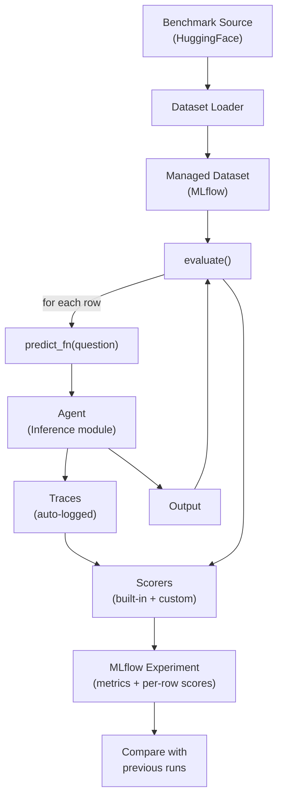
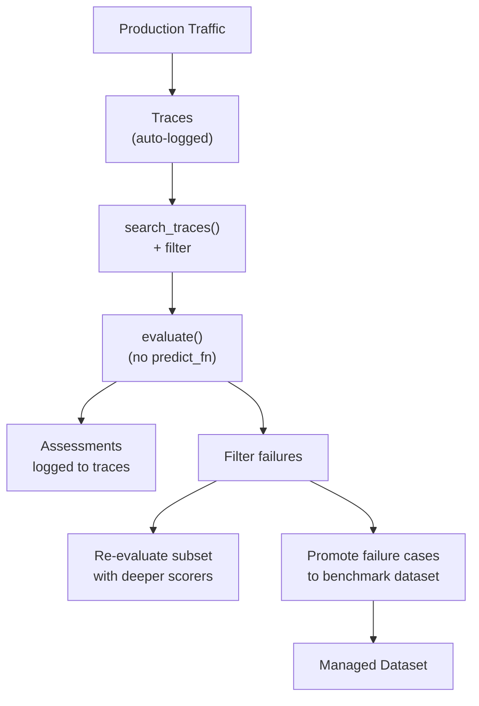
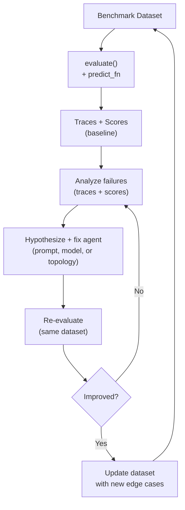
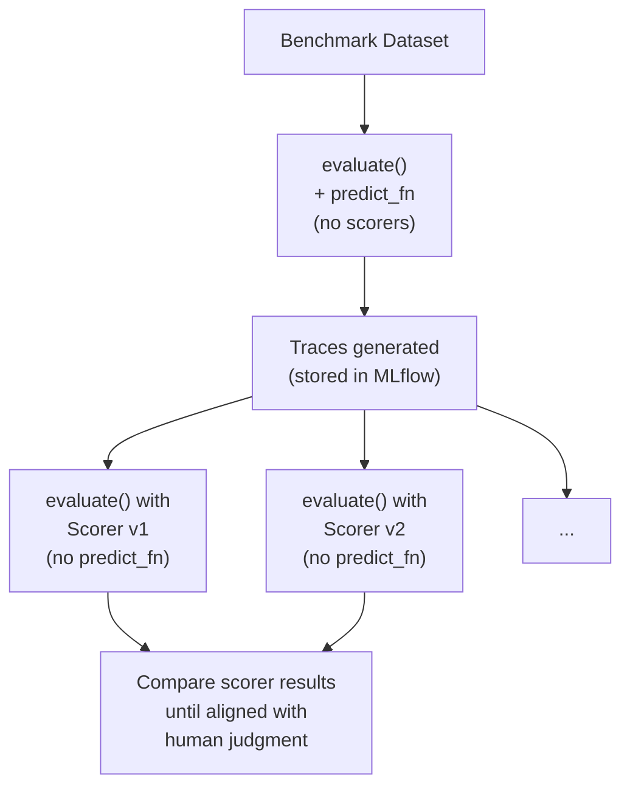

# MLflow Evaluation Capabilities Reference

A comprehensive reference on MLflow's GenAI evaluation system, compiled to inform ScholarBot's eval architecture. Based on MLflow 3.10.x documentation.

---

## Overview

MLflow's evaluation system centers on a single entry point — `mlflow.genai.evaluate()` — that supports multiple evaluation modes depending on what you're testing and what data you have. Everything revolves around **traces** as the primary data structure.

---

## Evaluation Modes

MLflow supports four evaluation modes, all through the same `evaluate()` API:

### 1. Agent Evaluation (predict_fn + dataset)

Run a live agent against a dataset and score the results.

```python
results = mlflow.genai.evaluate(
    data=eval_dataset,        # list of {inputs, expectations, tags}
    predict_fn=predict_fn,    # callable that runs the agent
    scorers=[Correctness(), ToolCallCorrectness()],
)
```

**When to use:** Systematic benchmarking, regression testing, CI/CD. You have a curated dataset and want to measure end-to-end agent performance.

**Key details:**
- `predict_fn` receives `**inputs` as kwargs — parameter names must match dataset `inputs` keys
- Must emit exactly one trace per call (auto-wrapped with `@mlflow.trace` if no autolog detected)
- Async `predict_fn` natively supported (auto-detected via `inspect.iscoroutinefunction`)
- Predictions run in parallel via `ThreadPoolExecutor` (configurable via `MLFLOW_GENAI_EVAL_MAX_WORKERS`)
- Traces are automatically captured and linked to the eval run

### 2. Trace Evaluation (pre-collected traces)

Score existing traces without re-running the agent.

```python
traces = mlflow.search_traces(filter_string="...")
results = mlflow.genai.evaluate(
    data=traces,              # DataFrame of pre-collected traces
    scorers=[Safety(), custom_scorer],
)
```

**When to use:** Evaluating production traffic, iterating on scorers cheaply, post-hoc analysis. The agent already ran — you're just scoring.

**Key insight:** Run the agent once, then evaluate the same traces with many different scorer configurations without paying LLM costs again.

### 3. Prompt Evaluation (predict_fn + prompt registry)

Test prompt templates against criteria. Same API as agent eval, but the predict_fn wraps a single LLM call with a registered prompt template.

**When to use:** Iterating on prompt quality, comparing prompt versions, A/B testing instructions.

### 4. Multi-Turn Evaluation (ConversationSimulator or session traces)

Evaluate full conversations, either simulated or pre-recorded.

```python
from mlflow.genai.simulators import ConversationSimulator

simulator = ConversationSimulator(
    test_cases=[
        {"goal": "Research transformer efficiency", "persona": "Graduate student"},
    ],
    max_turns=5,
)
results = mlflow.genai.evaluate(
    data=simulator,
    predict_fn=predict_fn,
    scorers=[ConversationCompleteness(), UserFrustration()],
)
```

**When to use:** Testing dialogue capabilities, validating multi-turn coherence. Traces are grouped by session via `mlflow.trace.session` metadata.

---

## The evaluate() API

```python
mlflow.genai.evaluate(
    data,                    # dataset (see formats below)
    scorers,                 # list of scorer objects
    predict_fn=None,         # optional callable
    model_id=None,           # optional model version link
) -> EvaluationResult
```

**Returns:** `EvaluationResult` with:
- `run_id` — the MLflow run ID for this eval
- `metrics` — aggregated metrics (`{"exact_match/mean": 0.67, ...}`)
- `result_df` — per-row DataFrame with all scores

---

## Dataset Formats

`evaluate()` accepts multiple data formats:

| Format | Best for | Notes |
|--------|----------|-------|
| `list[dict]` | Prototyping (< 100 examples) | `{inputs, expectations?, tags?}` |
| `pd.DataFrame` | Medium datasets | Same schema as list of dicts |
| `EvaluationDataset` | Production use | Managed, deduplicated, tagged |
| `list[Trace]` / trace DataFrame | Trace evaluation | From `mlflow.search_traces()` |
| `ConversationSimulator` | Multi-turn | Goal-based test cases |

### Dataset Schema

| Field | Type | Required | Purpose |
|-------|------|----------|---------|
| `inputs` | `dict` | Yes (unless trace column) | Agent inputs — keys must match `predict_fn` params |
| `expectations` | `dict` | No | Ground truth for scorers |
| `tags` | `dict` | No | Metadata for filtering |
| `outputs` | any | No | Pre-computed outputs (mutually exclusive with `predict_fn`) |
| `trace` | `Trace` | No | Pre-collected traces (mutually exclusive with `predict_fn`) |

### Reserved Expectation Keys

These trigger specific built-in scorer behavior:
- `expected_facts` — used by `Correctness`
- `expected_response` — used by `Correctness`
- `guidelines` — used by `Guidelines`
- `expected_retrieved_context` — used by `document_recall`

### MLflow Evaluation Datasets (Managed)

For production use, MLflow provides managed datasets with:
- Deduplication via input hashing (`merge_records` is an upsert)
- Tag-based organization and search
- Provenance tracking (trace, human, code, document sources)
- Attached to experiments via `experiment_id`
- **Requires SQL backend** (SQLite minimum — our Docker Compose MLflow uses SQLite)

```python
from mlflow.genai.datasets import create_dataset, get_dataset

dataset = create_dataset(
    name="deepsearchqa_v1",
    experiment_id=["1"],
    tags={"benchmark": "deepsearchqa", "sample_size": "25"},
)
dataset.merge_records(test_cases)

# Later retrieval
dataset = get_dataset(name="deepsearchqa_v1")
```

---

## Scorers

### The @scorer Decorator

```python
from mlflow.genai.scorers import scorer

@scorer
def exact_match(outputs, expectations) -> bool:
    return outputs == expectations["answer"]
```

**Parameter injection:** Declare only what you need. MLflow inspects the signature and passes matching values from: `inputs`, `outputs`, `expectations`, `trace`, `session`.

**Return types:** `bool`, `int`, `float`, `str`, `Feedback`, or `list[Feedback]`.

**`Feedback` for richer returns:**

```python
from mlflow.entities import Feedback

@scorer
def tool_trajectory(trace, expectations) -> Feedback:
    tool_spans = trace.search_spans(span_type=SpanType.TOOL)
    actual = [span.name for span in tool_spans]
    expected = expectations["tool_trajectory"]
    return Feedback(
        value=1 if actual == expected else 0,
        rationale=f"Expected: {expected}. Actual: {actual}.",
    )
```

### Trace-Aware Scoring

Scorers that declare `trace` as a parameter get the full `Trace` object with access to all spans:

```python
trace.search_spans(span_type=SpanType.TOOL)        # tool calls
trace.search_spans(span_type=SpanType.CHAT_MODEL)   # LLM calls
trace.search_spans(span_type=SpanType.RETRIEVER)     # retrieval calls
trace.search_spans(span_type=SpanType.AGENT)         # sub-agent calls
```

Each span exposes `.name`, `.inputs`, `.outputs`, `.start_time_ns`, `.end_time_ns`, `.attributes`.

### Built-In Scorers

| Category | Scorers |
|----------|---------|
| **Quality** | `Correctness`, `Equivalence`, `Completeness`, `Fluency`, `RelevanceToQuery`, `Summarization`, `KnowledgeRetention` |
| **Safety** | `Safety` |
| **Adherence** | `Guidelines`, `ExpectationsGuidelines` |
| **RAG** | `RetrievalGroundedness`, `RetrievalRelevance`, `RetrievalSufficiency` |
| **Agents** | `ToolCallCorrectness`, `ToolCallEfficiency` |
| **Multi-turn** | `ConversationCompleteness`, `ConversationalGuidelines`, `ConversationalRoleAdherence`, `ConversationalSafety`, `ConversationalToolCallEfficiency`, `UserFrustration` |

Built-in scorers use an LLM judge under the hood. The `model` parameter can be configured (defaults to an OpenAI model).

### Custom LLM Judges

```python
from mlflow.genai.judges import make_judge

grounded_judge = make_judge(
    name="response_grounded_in_sources",
    instructions="Evaluate if the response is grounded in the search results...",
    feedback_value_type=bool,
    model="openai:/gpt-4o-mini",
)
```

---

## Trace Correlation and Lifecycle

### During Agent Evaluation

1. MLflow generates a unique `eval_request_id` per dataset row
2. `predict_fn(**inputs)` runs inside a prediction context
3. The trace is captured and retrieved via `mlflow.get_trace(eval_request_id)`
4. After scoring, all traces are linked to the eval run via `batch_link_traces_to_run()`

### During Trace Evaluation

- Traces from `mlflow.search_traces()` are passed directly
- If traces belong to a different experiment, they're cloned to the current one
- Assessments (scorer outputs) are logged to each trace

### Hybrid Pattern (Generate-Then-Evaluate)

```python
# Step 1: Generate traces (expensive, done once)
results_gen = mlflow.genai.evaluate(
    data=dataset, predict_fn=predict_fn, scorers=[],
)

# Step 2: Retrieve traces
traces = mlflow.search_traces(run_id=results_gen.run_id)

# Step 3: Score cheaply, many times
for scorer_set in [safety_scorers, quality_scorers, domain_scorers]:
    mlflow.genai.evaluate(data=traces, scorers=scorer_set)
```

---

## Workflows Enabled

### 1. Benchmark Regression Testing

Run the agent against a curated dataset on every change. Compare eval runs across iterations. This is the primary workflow for ScholarBot's eval harness.



**Step 1: Construct the dataset from the benchmark source**

```python
from datasets import load_dataset
from mlflow.genai.datasets import create_dataset

# Load from HuggingFace
hf_ds = load_dataset("google/deepsearchqa")["eval"]

# Sample and transform to MLflow schema
samples = hf_ds.shuffle(seed=42).select(range(25))
test_cases = [
    {
        "inputs": {"question": row["problem"]},
        "expectations": {"answer": row["answer"], "answer_type": row["answer_type"]},
        "tags": {"category": row["problem_category"]},
    }
    for row in samples
]

# Store as managed dataset (optional — list of dicts works for prototyping)
dataset = create_dataset(
    name="deepsearchqa_v1",
    experiment_id=["1"],
    tags={"benchmark": "deepsearchqa", "sample_size": "25"},
)
dataset.merge_records(test_cases)
```

**Step 2: Define the predict function**

```python
import httpx

SERVER_URL = "http://localhost:8000"

def predict_fn(question: str) -> str:
    response = httpx.post(
        f"{SERVER_URL}/chat",
        json={"question": question},
        timeout=300,
    )
    response.raise_for_status()
    return response.json()["answer"]
```

**Step 3: Run evaluation**

```python
import mlflow
from mlflow.genai.scorers import Correctness, ToolCallCorrectness

mlflow.set_experiment("scholarbot-eval")

results = mlflow.genai.evaluate(
    data=test_cases,          # or: data=dataset (managed)
    predict_fn=predict_fn,
    scorers=[Correctness(), ToolCallCorrectness()],
)

print(f"Metrics: {results.metrics}")
print(f"Per-row results:\n{results.result_df}")
```

**Step 4: Compare across iterations**

```python
# After making an improvement, run eval again with the same dataset
results_v2 = mlflow.genai.evaluate(
    data=test_cases,
    predict_fn=predict_fn,  # same fn, but agent code changed
    scorers=[Correctness(), ToolCallCorrectness()],
)

# Compare in MLflow UI or programmatically
print(f"v1: {results.metrics}")
print(f"v2: {results_v2.metrics}")
```

---

### 2. Production Quality Monitoring

Collect traces from a deployed agent, filter interesting ones, score offline. No agent re-execution needed.



**Step 1: Retrieve production traces**

```python
import mlflow
from datetime import datetime, timedelta

yesterday = datetime.now() - timedelta(days=1)
traces = mlflow.search_traces(
    filter_string=f"timestamp > {int(yesterday.timestamp() * 1000)}",
)
```

**Step 2: Score without re-running the agent**

```python
from mlflow.genai.scorers import Safety, Correctness

results = mlflow.genai.evaluate(
    data=traces,              # pre-collected — no predict_fn needed
    scorers=[Safety(), Correctness()],
)
```

**Step 3: Filter failures and drill deeper**

```python
# Find safety failures
failure_traces = mlflow.search_traces(run_id=results.run_id)
safety_failures = failure_traces[
    failure_traces["assessments"].apply(
        lambda x: any(
            a["assessment_name"] == "Safety" and a["feedback"]["value"] == "no"
            for a in x
        )
    )
]

# Re-evaluate failures with more targeted scorers
if len(safety_failures) > 0:
    mlflow.genai.evaluate(
        data=safety_failures,
        scorers=[Guidelines(name="content_policy", guidelines="...")],
    )
```

**Step 4: Promote failure cases to the benchmark dataset**

```python
from mlflow.genai.datasets import get_dataset

# Add interesting failures to the regression test suite
dataset = get_dataset(name="deepsearchqa_v1")
failure_cases = [
    {
        "inputs": {"question": row["inputs"]["question"]},
        "expectations": {"answer": "manually reviewed correct answer"},
        "tags": {"source": "production_failure", "category": "safety"},
    }
    for _, row in safety_failures.iterrows()
]
dataset.merge_records(failure_cases)
```

---

### 3. Self-Improving Agent Loop

The development-time cycle: trace → analyze → score → fix → verify. Driven by a developer (or coding assistant) analyzing eval results and making targeted improvements.



**Step 1: Establish baseline**

```python
import mlflow
from mlflow.genai.scorers import Correctness, ToolCallCorrectness, scorer
from mlflow.entities import Feedback

mlflow.set_experiment("scholarbot-eval")

# Custom scorer for answer correctness against DeepSearchQA ground truth
@scorer
def deepsearchqa_match(outputs, expectations) -> Feedback:
    # DeepSearchQA uses exact match or set overlap depending on answer_type
    if expectations["answer_type"] == "Set Answer":
        expected = set(s.strip() for s in expectations["answer"].split(","))
        actual_text = outputs.lower()
        hits = sum(1 for item in expected if item.lower() in actual_text)
        score = hits / len(expected) if expected else 0
        return Feedback(value=score, rationale=f"Matched {hits}/{len(expected)} set items")
    else:
        match = expectations["answer"].lower() in outputs.lower()
        return Feedback(value=1.0 if match else 0.0, rationale=f"Expected: {expectations['answer']}")

baseline = mlflow.genai.evaluate(
    data=test_cases,
    predict_fn=predict_fn,
    scorers=[deepsearchqa_match, ToolCallCorrectness()],
)
print(f"Baseline: {baseline.metrics}")
```

**Step 2: Analyze failures**

```python
# Get per-row results
df = baseline.result_df
failures = df[df["deepsearchqa_match/value"] < 0.5]
print(f"{len(failures)} failures out of {len(df)}")

# Inspect traces for failure cases
for _, row in failures.head(5).iterrows():
    trace = mlflow.get_trace(row["trace_id"])
    tool_spans = trace.search_spans(span_type="TOOL")
    print(f"\nQ: {row['inputs']['question']}")
    print(f"Expected: {row['expectations']['answer']}")
    print(f"Got: {row['outputs'][:200]}")
    print(f"Searches: {[s.inputs for s in tool_spans]}")
```

**Step 3: Fix and re-evaluate**

```python
# After modifying agent (prompt, model, or topology)...
improved = mlflow.genai.evaluate(
    data=test_cases,          # same dataset
    predict_fn=predict_fn,    # same fn, but agent changed
    scorers=[deepsearchqa_match, ToolCallCorrectness()],
)

# Compare
print(f"Baseline: {baseline.metrics}")
print(f"Improved: {improved.metrics}")
```

---

### 4. Scorer Development (Generate-Then-Evaluate)

Generate traces once (expensive), then iterate on scorers cheaply without re-running the agent.



**Step 1: Generate traces (pay agent cost once)**

```python
# Run agent against dataset, but don't score yet
gen_results = mlflow.genai.evaluate(
    data=test_cases,
    predict_fn=predict_fn,
    scorers=[],               # no scorers — just generate traces
)
```

**Step 2: Retrieve traces**

```python
traces = mlflow.search_traces(run_id=gen_results.run_id)
```

**Step 3: Iterate on scorers cheaply**

```python
# Try scorer v1
results_v1 = mlflow.genai.evaluate(
    data=traces,              # reuse traces — no agent cost
    scorers=[deepsearchqa_match],
)

# Manually review a sample to calibrate
# ...

# Try scorer v2 (e.g., LLM-as-judge)
from mlflow.genai.judges import make_judge

answer_judge = make_judge(
    name="answer_quality",
    instructions=(
        "Compare the agent's response to the expected answer. "
        "The response should contain the key facts from the expected answer. "
        "For set answers, check if all items are mentioned."
    ),
    feedback_value_type=bool,
)

results_v2 = mlflow.genai.evaluate(
    data=traces,
    scorers=[answer_judge],
)

# Compare scorer agreement
print(f"Scorer v1: {results_v1.metrics}")
print(f"Scorer v2: {results_v2.metrics}")
```

---

## Implications for ScholarBot

### What this means for the eval architecture:

1. **`predict_fn` is the integration point.** It wraps our agent — either as a direct SDK call or an HTTP call to `/chat`. MLflow handles parallelization and trace capture.

2. **The DeepSearchQA dataset maps directly** to MLflow's `{inputs, expectations}` schema. `inputs: {question}`, `expectations: {answer, answer_type}`, `tags: {problem_category}`.

3. **Trace-aware scorers unlock deep evaluation.** Beyond answer correctness, we can score search strategy (tool call trajectory), source quality (retrieved URLs), and reasoning quality (ThinkingBlocks, once traced).

4. **The hybrid pattern saves cost.** Run the agent once against the dataset, then develop and iterate scorers against those traces without re-running the agent each time.

5. **MLflow Evaluation Datasets provide managed test suites.** Once we move past prototyping, DeepSearchQA samples can be stored as managed datasets with tagging and deduplication.

6. **Multi-turn evaluation is available** when we need it (Milestone 5+), but ScholarBot's current single-turn research pattern fits the standard agent evaluation mode.

7. **The self-improving loop aligns with our methodology.** Trace → analyze → score → fix → verify maps directly to the Iteration Loop (Build → Validate → Adapt → Sync).
