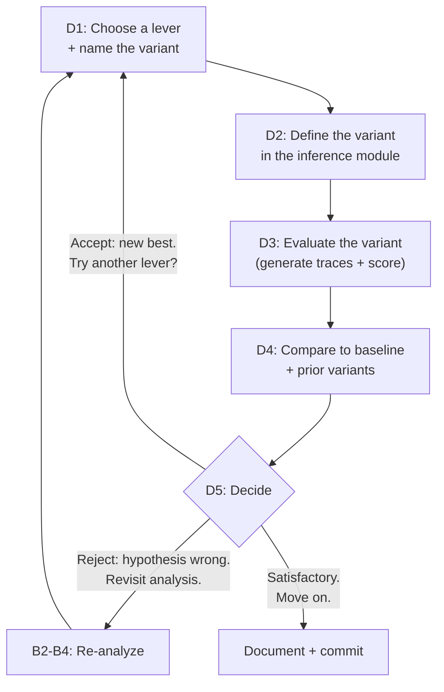
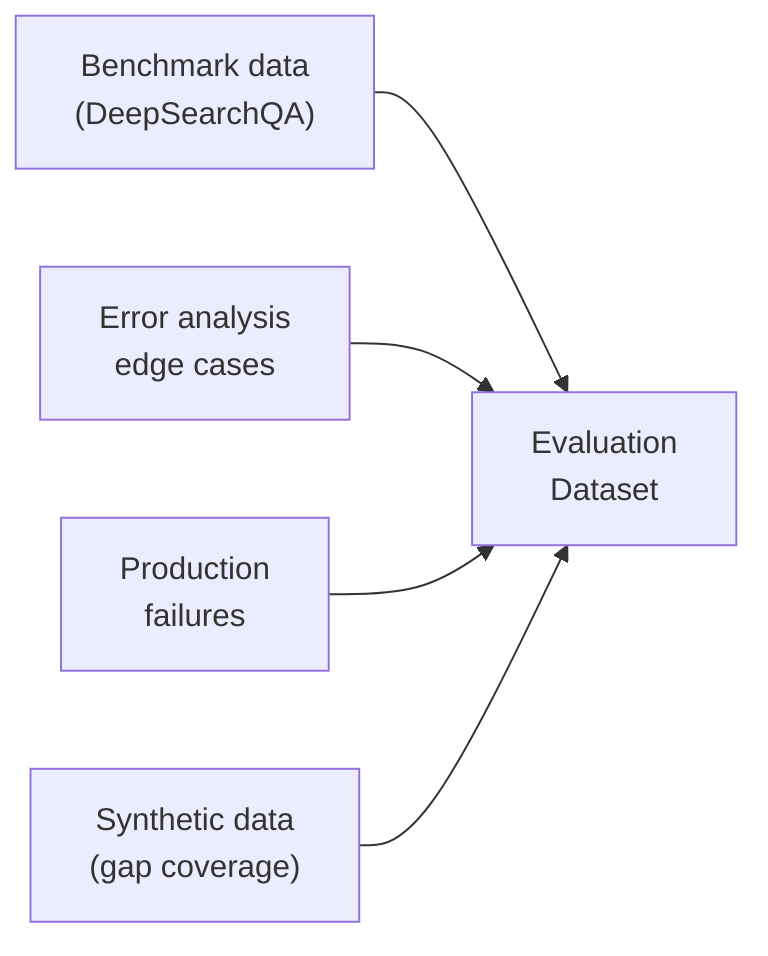

# Evaluation Guide

A walkthrough for systematically measuring and improving ScholarBot's research quality — from establishing a baseline through verified improvement.

Informed by: [MLflow self-improving agent loop](https://mlflow.org/blog/self-improving-agent-loop), [OpenAI Harness Engineering](https://openai.com/index/harness-engineering/), [Hamel Husain's eval methodology](https://hamel.dev/blog/posts/evals-skills/), and [The Revenge of the Data Scientist](https://hamel.dev/blog/posts/revenge/). For MLflow API reference, see [EVAL_CAPABILITIES.md](EVAL_CAPABILITIES.md).

This guide is designed to be followed sequentially the first time through. After that, the cycle tightens — see [The Rhythm](#the-rhythm) at the end.

---

## Your Workspace

You'll work across three surfaces, each with a clear role:

| Surface | Role | When you're here |
|---------|------|-----------------|
| **Evaluation notebook** | Command center — generate traces, write scorers, compare variants | Most of the time |
| **MLflow UI** (localhost:5000) | Deep trace inspection, annotation, experiment comparison | When you need to see what the agent actually did |
| **Inference module** (`src/inference/`) | The agent itself — where variants are defined | When creating a new variant |

The notebook is home base. You start there, link out to MLflow when you need to look deeper, and return to the notebook to continue.

Before starting, make sure Docker Compose is running (MLflow needs to be up) and your `.env` has the Foundry credentials set.

---

## One-Time Setup

These steps run once and don't repeat across cycles.

### Setup the notebook

```python
from dotenv import load_dotenv
load_dotenv()

import mlflow
import mlflow.anthropic

mlflow.set_tracking_uri("http://localhost:5000")
mlflow.set_experiment("scholarbot-eval")
mlflow.anthropic.autolog()
```

### Prepare the dataset

Load DeepSearchQA and transform it into the eval schema. This produces the seed dataset — a living artifact that grows over time, but is loaded once and reused across all cycles.

```python
from datasets import load_dataset

hf_ds = load_dataset("google/deepsearchqa")["eval"]

# Start small — 25 examples. Large enough to see patterns, small enough to review by hand.
samples = hf_ds.shuffle(seed=42).select(range(25))

test_cases = [
    {
        "inputs": {"question": row["problem"]},
        "expectations": {
            "answer": row["answer"],
            "answer_type": row["answer_type"],
        },
        "tags": {"category": row["problem_category"]},
    }
    for row in samples
]

print(f"Loaded {len(test_cases)} test cases")
print(f"Categories: {set(tc['tags']['category'] for tc in test_cases)}")
```

Glance at a few examples. Get a feel for what DeepSearchQA is asking:

```python
for tc in test_cases[:3]:
    print(f"\nQ: {tc['inputs']['question'][:150]}...")
    print(f"A: {tc['expectations']['answer']}")
    print(f"Type: {tc['expectations']['answer_type']}")
    print(f"Category: {tc['tags']['category']}")
```

Notice the question style — these are complex, multi-hop research questions with specific factual answers. Some are single answers ("New Zealand"), others are sets ("Combat, Skilling, Utility"). This matters for how you'll score them later.

---

## Agent Variants

Every improvement attempt is tracked as a named **variant**. A variant is a specific configuration of the agent — a combination of prompt, model, and topology. Naming variants explicitly makes it possible to trace, analyze, and evaluate each attempt independently and compare them side by side.

### Naming convention

```
v1-baseline              — the initial agent, unmodified
v2-decompose-prompt      — system prompt instructs question decomposition
v3-sonnet-upgrade        — model upgraded from Haiku to Sonnet
v4-decompose-sonnet      — combines v2 prompt with v3 model
```

The name encodes **what changed**. When you see a variant name in MLflow, you know exactly what it represents.

### Defining a variant

Variants live in the inference module. The simplest approach — a function that returns the options for a named variant:

```python
# src/inference/__init__.py

def get_agent_options(variant: str = "v1-baseline") -> ClaudeAgentOptions:
    """Return agent configuration for a named variant."""
    ...
```

The `predict_fn` in the notebook accepts a variant name:

```python
import asyncio
from inference import research

def make_predict_fn(variant: str):
    def predict_fn(question: str) -> str:
        return asyncio.run(research(question, variant=variant))
    return predict_fn
```

### Tracking variants in MLflow

Each variant's traces are tagged so you can filter and compare:

```python
def evaluate_variant(variant: str, test_cases, scorers=None):
    """Generate traces and optionally score a variant. Returns the eval result."""
    predict_fn = make_predict_fn(variant)

    with mlflow.start_run(run_name=variant, tags={"variant": variant}):
        results = mlflow.genai.evaluate(
            data=test_cases,
            predict_fn=predict_fn,
            scorers=scorers or [],
        )
    return results
```

This produces one MLflow run per variant, with the variant name as both the run name and a searchable tag.

---

## Phase B: Establish Baseline

### B1. Generate traces for the baseline variant

Run `v1-baseline` against the dataset. This is the expensive step — each question triggers web searches and LLM reasoning. On 25 questions with Haiku, expect 5-15 minutes.

```python
baseline_result = evaluate_variant("v1-baseline", test_cases)
print(f"Generated {len(baseline_result.result_df)} traces")
```

While traces generate, this is a good time to review the dataset examples more carefully. When it finishes, switch to the **MLflow UI** (http://localhost:5000). Navigate to the `scholarbot-eval` experiment. You should see a run named `v1-baseline` with 25 traces. Open a few traces and browse — get oriented in the UI before the structured analysis begins.

### B2. Look at the data (human step)

This is the most important step. Before any automated analysis, you need to build intuition about what the agent does well and where it struggles.

**Pick 5-10 traces and read them end-to-end.** For each one:

1. Read the **question** and the **expected answer**
2. Read the agent's **final answer** — is it correct? Partially correct? Wrong?
3. Expand the trace and read the **search queries** — did the agent search for the right things?
4. Look at the **search results** — did useful information come back?
5. Read the **reasoning** (if ThinkingBlocks are traced) — did the agent use the evidence well?

As you read, take notes. Not formal categories yet — just what you notice:

```python
# Your observations go here — replace with what you actually see
observations = """
Trace 1: Q about New Zealand politics. Agent searched correctly, got the right answer.
Trace 4: Q about Fed rate decisions. Agent searched too broadly, missed the specific data point.
Trace 7: Q about a historical event. Agent cited a URL that wasn't in its search results.
Trace 12: Q requiring set answer. Agent found 2 of 3 items, missed the third.
...
"""
print(observations)
```

**What you're looking for:** Not just right/wrong, but *patterns in how the agent fails*. Does it search badly? Reason badly? Miss evidence? Fabricate sources? Each failure mode suggests a different fix.

### B3. Coding agent analyzes the full set

Now let the coding agent do what it's good at — systematic analysis across all 25 traces. You've built intuition from your sample; the coding agent provides breadth.

Ask your coding agent (in Claude Code, not in the notebook):

> Analyze the traces in MLflow experiment "scholarbot-eval", run "v1-baseline". For each trace, compare the agent's answer to the expected answer. Categorize failures into specific, application-level categories — not generic labels like "hallucination" but specific patterns like "wrong search strategy" or "missed evidence in search results." Report the categories with counts and example traces for each.

Review what comes back. Does it match what you saw in your manual sample? Are there patterns you missed? Are any categories too broad? Refine until the categories feel actionable — each one should point toward a specific improvement.

### B4. Annotate traces

With failure categories identified, annotate each trace in MLflow's Annotation UI:

1. Open each trace in the MLflow UI
2. Mark it **pass** or **fail**
3. If fail, note the **failure category** (from the categories you agreed on in B3)

These annotations are your ground truth. When you build automated scorers in Phase C, you'll validate them against these annotations. The quality of your annotations determines the quality of your scorers.

**Criteria drift is normal.** As you annotate, your sense of what "pass" means will sharpen. You may realize a category needs splitting, or two categories are really one. That's fine — update the categories and re-annotate the affected traces.

When you're done, summarize what you found:

```python
# Replace with your actual findings
failure_categories = {
    "wrong_search_strategy": {"count": 8, "description": "Agent searched too broadly or for the wrong thing"},
    "missed_evidence": {"count": 5, "description": "Relevant info in search results not used in answer"},
    "fabricated_citation": {"count": 2, "description": "Agent cited a source not in its search results"},
    "partial_set_match": {"count": 3, "description": "For set answers, agent found some but not all items"},
}

total_failures = sum(c["count"] for c in failure_categories.values())
print(f"Pass: {25 - total_failures}/25")
print(f"Fail: {total_failures}/25")
print(f"\nFailure breakdown:")
for cat, info in sorted(failure_categories.items(), key=lambda x: -x[1]["count"]):
    print(f"  {cat}: {info['count']} — {info['description']}")
```

You now have a baseline. You know what the agent does, how often it fails, and *why* it fails. This is the foundation everything else builds on.

---

## Phase C: Formalize Evaluation

### C1. Write scorers grounded in your categories

Each failure category from Phase B gets its own scorer. The scorer should be **binary pass/fail** and **specific to the pattern you observed**.

Start in the notebook. Write one scorer at a time, test it against a few traces, then move to the next.

```python
from mlflow.genai.scorers import scorer
from mlflow.entities import Feedback
```

**Deterministic scorers** for mechanical checks:

```python
@scorer
def answer_contains_ground_truth(outputs, expectations) -> Feedback:
    """Does the agent's answer contain the expected answer?"""
    expected = expectations["answer"].lower()
    actual = outputs.lower()

    if expectations["answer_type"] == "Set Answer":
        items = [s.strip().lower() for s in expected.split(",")]
        hits = sum(1 for item in items if item in actual)
        score = hits / len(items) if items else 0
        return Feedback(
            value=score,
            rationale=f"Matched {hits}/{len(items)} expected items",
        )
    else:
        match = expected in actual
        return Feedback(
            value=1.0 if match else 0.0,
            rationale=f"Expected '{expectations['answer']}' {'found' if match else 'not found'} in response",
        )
```

**Trace-aware scorers** that examine the agent's process, not just its output:

```python
@scorer
def search_query_relevance(trace, inputs) -> Feedback:
    """Did the agent's search queries target the right information?"""
    tool_spans = trace.search_spans(span_type="TOOL")
    queries = [s.inputs.get("query", "") for s in tool_spans if s.name == "tool_WebSearch"]

    if not queries:
        return Feedback(value=0.0, rationale="No web searches performed")

    # Application-specific logic based on your observed patterns
    ...
```

**LLM-as-judge scorers** for qualitative assessment:

```python
from mlflow.genai.judges import make_judge

evidence_grounding = make_judge(
    name="evidence_grounding",
    instructions=(
        "Examine the trace: {{ trace }}\n\n"
        "Determine whether the agent's final response is supported by "
        "evidence from its web search results. Answer 'yes' if every "
        "factual claim in the response can be traced to a search result. "
        "Answer 'no' if the response contains claims not supported by "
        "any search result."
    ),
    feedback_value_type=bool,
)
```

You don't need to write all scorers at once. Start with the highest-priority failure category from your B4 summary and build outward.

### C2. Run scorers against existing traces

This is where the generate-then-evaluate optimization pays off. You're scoring the same traces from B1 — no agent re-execution, no LLM cost beyond the judge calls.

```python
# Retrieve traces from the baseline run
traces = mlflow.search_traces(
    filter_string="tags.variant = 'v1-baseline'",
)

# Score them
scored_results = mlflow.genai.evaluate(
    data=traces,
    scorers=[
        answer_contains_ground_truth,
        search_query_relevance,
        evidence_grounding,
    ],
)

print(f"Metrics: {scored_results.metrics}")
```

Look at the per-row results. Do the scores make sense for the traces you reviewed by hand?

```python
df = scored_results.result_df
print(df[["inputs", "outputs", "answer_contains_ground_truth/value", "evidence_grounding/value"]].to_string())
```

### C3. Validate scorer alignment

Now the critical check: **do your scorers agree with your annotations from B4?**

Compare scorer outputs to your human labels. For each scorer, compute precision and recall.

```python
agreements = 0
false_positives = 0  # scorer says pass, human says fail
false_negatives = 0  # scorer says fail, human says pass

for _, row in df.iterrows():
    scorer_pass = row["answer_contains_ground_truth/value"] >= 0.5
    human_pass = ...  # your annotation for this trace

    if scorer_pass == human_pass:
        agreements += 1
    elif scorer_pass and not human_pass:
        false_positives += 1
    else:
        false_negatives += 1

total = agreements + false_positives + false_negatives
precision = agreements / (agreements + false_positives) if (agreements + false_positives) > 0 else 0
recall = agreements / (agreements + false_negatives) if (agreements + false_negatives) > 0 else 0

print(f"Precision: {precision:.2f}")
print(f"Recall: {recall:.2f}")
```

**If alignment is poor:** Look at the disagreements. Where the scorer says pass but you said fail — the scorer is too lenient. Where it says fail but you said pass — it's too strict. Adjust the scorer logic or judge prompt and re-run C2 (cheap — same traces).

**When alignment is sufficient:** You've built a scorer you can trust. It captures your judgment in code. From now on, it runs automatically.

### C4. Establish the scored baseline

Once your scorers are validated, score the baseline variant officially. This is the number you'll improve against.

```python
scorer_suite = [
    answer_contains_ground_truth,
    search_query_relevance,
    evidence_grounding,
]

baseline_scored = evaluate_variant("v1-baseline", test_cases, scorers=scorer_suite)

print("=== v1-baseline SCORED ===")
for metric, value in sorted(baseline_scored.metrics.items()):
    print(f"  {metric}: {value:.3f}")
```

This is the floor. Everything in Phase D is measured against it.

---

## Phase D: Improve

Phase D is a loop. Each iteration introduces a new variant, evaluates it, and compares it to the baseline and all prior variants. You stay in this loop until you're satisfied or until improvements plateau.



### D1. Choose a lever and name the variant

You have three optimization levers. Pick **one** per variant so you can measure its impact cleanly:

| Lever | What to try | When to try it |
|-------|------------|---------------|
| **Prompt** | System prompt refinements — search strategy instructions, synthesis guidance, citation requirements | First. Cheapest to test. |
| **Model** | Upgrade from Haiku to Sonnet or Opus | When prompt changes plateau. Higher reasoning capacity may fix decomposition and evidence synthesis. |
| **Topology** | Subagents — a research planner, a search executor, a synthesizer | When single-agent improvements plateau. Highest complexity. |

Based on your failure analysis, which lever is most likely to address the top failure category?

Name the variant to encode what changed:

```python
next_variant = "v2-decompose-prompt"  # descriptive name for what you're trying
```

### D2. Define the variant

Open the inference module and add the variant configuration. One targeted change — don't change multiple things at once.

```python
# In src/inference/__init__.py — add to get_agent_options()

if variant == "v2-decompose-prompt":
    return ClaudeAgentOptions(
        model="claude-haiku-4-5",
        permission_mode="bypassPermissions",
        allowed_tools=["WebSearch", "WebFetch"],
        system_prompt=(
            "You are ScholarBot, a research assistant. "
            "When asked a complex question, first decompose it into "
            "2-3 specific sub-questions, then search for each separately. "
            "Synthesize findings across all searches into a comprehensive answer. "
            "Cite every source with its URL."
        ),
        max_turns=10,
    )
```

### D3. Evaluate the variant

Back in the notebook. Same dataset, same scorers, new variant.

```python
variant_result = evaluate_variant(next_variant, test_cases, scorers=scorer_suite)

print(f"=== {next_variant} ===")
for metric, value in sorted(variant_result.metrics.items()):
    print(f"  {metric}: {value:.3f}")
```

### D4. Compare

Side by side against the baseline and any prior variants:

```python
# Collect all variant results for comparison
variants = {
    "v1-baseline": baseline_scored,
    next_variant: variant_result,
}

# Compare metrics across variants
metrics = sorted(baseline_scored.metrics.keys())
header = f"{'Metric':<45}" + "".join(f"{v:>15}" for v in variants.keys())
print(header)
print("-" * len(header))
for metric in metrics:
    row = f"{metric:<45}"
    for v_name, v_result in variants.items():
        row += f"{v_result.metrics.get(metric, 0):>15.3f}"
    print(row)
```

Check for regressions at the per-question level — did fixing one category break another?

```python
# Which specific questions changed?
b_df = baseline_scored.result_df
v_df = variant_result.result_df

for i in range(len(b_df)):
    b_score = b_df.iloc[i]["answer_contains_ground_truth/value"]
    v_score = v_df.iloc[i]["answer_contains_ground_truth/value"]
    if abs(b_score - v_score) > 0.1:
        direction = "IMPROVED" if v_score > b_score else "REGRESSED"
        question = b_df.iloc[i]["inputs"]["question"][:100]
        print(f"\n{direction}: {question}...")
        print(f"  {b_score:.2f} → {v_score:.2f}")
```

### D5. Decide

Three possible outcomes:

**Accept the variant.** Scores improved, no meaningful regressions. This variant becomes the new best. You can:
- Try another lever on top of this one (→ D1, e.g., `v3-decompose-sonnet`)
- Move on if improvement is sufficient (→ Document + commit)

**Reject the variant.** Scores didn't improve, or regressions outweigh gains. The hypothesis was wrong. Go back to your failure analysis (B2-B4) — re-examine the traces that didn't improve and refine your understanding of *why*.

**Accept with caveats.** Net positive but some regressions. Investigate whether the regressions are acceptable (e.g., a category you care less about) or whether you can adjust the change to mitigate them.

In all cases, **document what you tried, what happened, and what you learned** in the milestone journal. This is the raw material for blog posts and for informing future cycles.

---

## Variant History

As you iterate through Phase D, build up a comparison table:

```python
# After several iterations, your variant history might look like:
variant_history = {
    "v1-baseline":          {"answer_match": 0.48, "search_relevance": 0.60, "grounding": 0.72},
    "v2-decompose-prompt":  {"answer_match": 0.56, "search_relevance": 0.76, "grounding": 0.72},
    "v3-sonnet-upgrade":    {"answer_match": 0.64, "search_relevance": 0.68, "grounding": 0.84},
    "v4-decompose-sonnet":  {"answer_match": 0.72, "search_relevance": 0.80, "grounding": 0.88},
}
```

This table tells the story of your improvement process. Each row is a hypothesis tested and measured. The variant names tell you what changed. The numbers tell you whether it worked.

---

## The Rhythm

After the first full cycle, the rhythm tightens. The one-time setup is done. The dataset is loaded. The scorers are written and validated. Most of the work is now in Phase D:

```
Notebook: define next variant name
         ↓
Editor: add variant config to inference module (one change)
         ↓
Notebook: evaluate_variant() — generates traces + scores (5-15 min)
         ↓
Notebook: compare to baseline + prior variants
         ↓
Notebook: decide — accept, reject, or investigate
         ↓
Journal: document what happened
         ↓
         loop
```

Occasionally, new failure categories emerge — especially when you improve one area and unmask a previously hidden issue. When that happens, loop back to B2-B4: look at the new failures, annotate, and potentially add new scorers (C1-C3). Then resume D.

Each D-cycle takes less time than the last. The infrastructure is in place. You're only changing one thing and measuring the result.

### Bootstrap vs. steady state

The first cycle feels different from later ones:

| | First cycle | Subsequent cycles |
|---|---|---|
| **Error analysis** | Discovering categories for the first time. More time in B2-B4. | Confirming known categories, discovering occasional new ones. |
| **Scorers** | Written from scratch. Alignment validation is new. | Incrementally refined. New scorers only for new categories. |
| **Improvements** | Large gains from obvious fixes. | Diminishing returns — each improvement is more targeted. |
| **Dataset** | Seed data only. | Enriched with edge cases and production examples. |

### The dataset grows with every cycle


